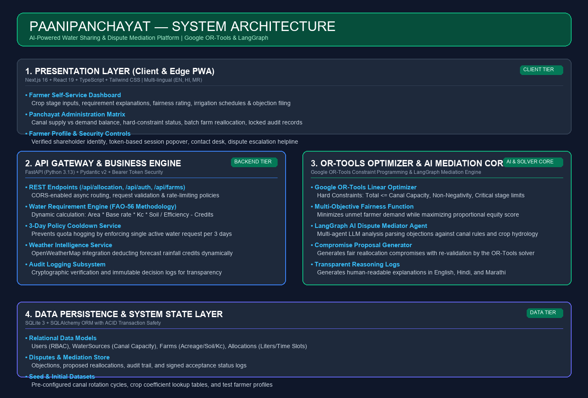
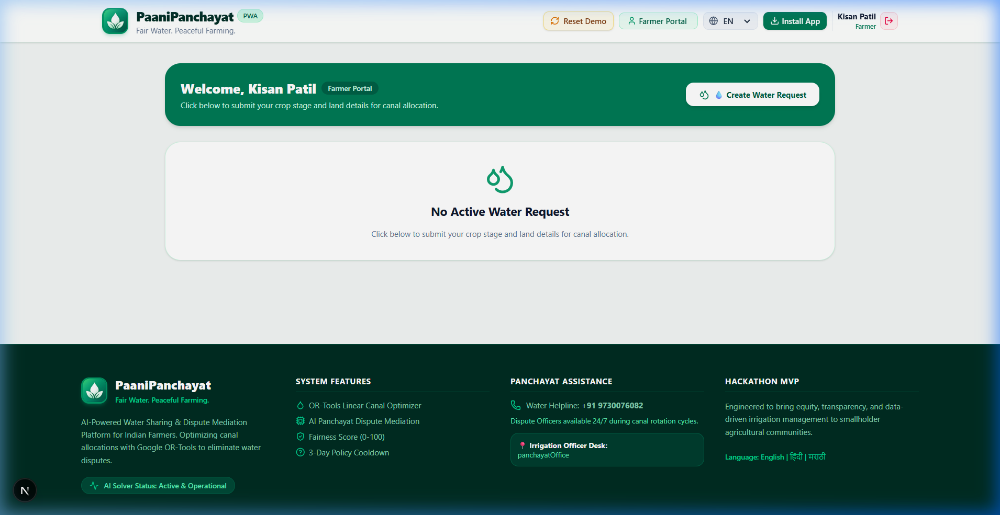
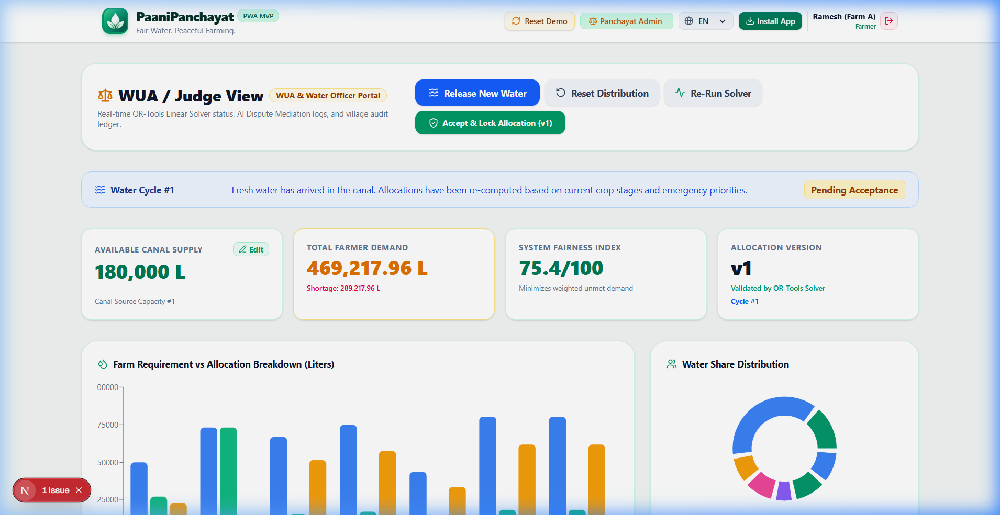
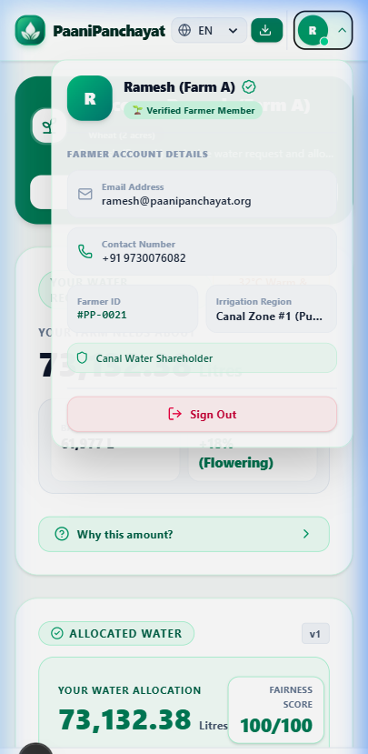
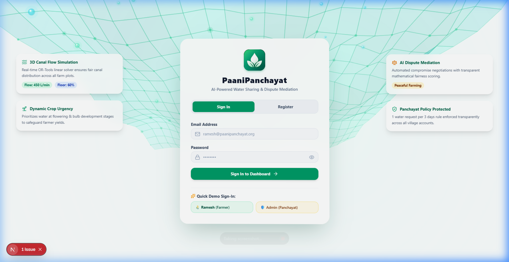

# 💧 PaaniPanchayat (पानी पंचायत)
### *Fair Water. Peaceful Farming.*

[](LICENSE)
[](https://python.org)
[](https://fastapi.tiangolo.com)
[](https://developers.google.com/optimization)
[](https://nextjs.org)
[](https://www.typescriptlang.org)
[](https://tailwindcss.com)
[](https://web.dev/progressive-web-apps/)

---

## 📌 Executive Summary

In canal-irrigated agricultural regions across India, equitable water distribution is among the most contentious challenges facing farming communities. Upstream farmers frequently over-extract rotational canal flow, leading to **"tail-end starvation"** where downstream farmers face catastrophic crop loss. The absence of scientific measurement and transparent scheduling sparks interpersonal disputes, delays irrigation, and strains rural social cohesion.

**PaaniPanchayat** solves this systemic crisis through a transparent, AI-powered water sharing and dispute mediation platform. By coupling **Google OR-Tools Linear Programming** with scientific **FAO-56 crop hydrology modeling** and **LangGraph/Gemini AI dispute mediation**, PaaniPanchayat guarantees provably fair canal water distribution, eliminates water theft and quota hoarding, and resolves conflicts transparently in **English, Hindi (हिंदी), and Marathi (मराठी)**.

---

## 🌟 Key Platform Innovations

- 🧮 **Google OR-Tools Linear Optimization**: Allocates canal water under hard physical constraints ($\sum x_i \le V_{\text{available}}$, non-negativity, minimum critical thresholds) while optimizing for maximum equity and fairness (0–100 fairness score).
- 🌱 **Scientific Crop Hydrology (FAO-56)**: Calculates individual farm water needs dynamically based on acreage, crop type ($K_c$ coefficient), growth stage, soil type, irrigation efficiency (Drip 90%, Sprinkler 75%, Flood 60%), and rainfall credits.
- ⏱️ **3-Day Policy Cooldown Protection**: Prevents quota hoarding by enforcing a strict panchayat rule: each farmer is allowed 1 water request per 3-day canal rotation cycle, with a live countdown timer.
- 🤖 **AI Panchayat Dispute Mediation**: When a farmer raises an objection, an autonomous AI mediation agent parses the hydrological facts and proposes a balanced compromise, re-validated by the OR-Tools solver before locking into an immutable audit trail.
- 🗣️ **Trilingual Localization**: Native support for **English**, **हिंदी (Hindi)**, and **मराठी (Marathi)** across every button, card, breakdown factor, and mediation explanation.
- 👤 **Role-Based Profile & Security**: Dedicated Farmer Profile card with farmer ID (`#PP-0108`), contact info, canal zone assignment, shareholder status badge, and token-based authentication.
- 📱 **Mobile-First Progressive Web App (PWA)**: Installable directly onto farmers' mobile devices with offline-friendly caching and app shortcut integration.

---

## 🏛️ System Architecture



```
┌────────────────────────────────────────────────────────────────────────┐
│                   PRESENTATION LAYER (Next.js 16 PWA)                  │
│       Farmer Self-Service Dashboard   │   Panchayat Admin Matrix       │
│       Multi-lingual Engine (EN/HI/MR) │   Farmer Profile Card & PWA    │
└───────────────────────────────────┬────────────────────────────────────┘
                                    │ HTTP / JSON REST APIs
┌───────────────────────────────────▼────────────────────────────────────┐
│                    API GATEWAY & ENGINE (FastAPI)                      │
│       • RBAC Token Authentication     • 3-Day Cooldown Service         │
│       • Crop Hydrology Calculator     • Weather Forecast Deductions    │
└───────────────────┬───────────────────────────────────┬────────────────┘
                    │                                   │
┌───────────────────▼─────────────┐   ┌─────────────────▼────────────────┐
│  Google OR-Tools Solver Core    │   │  AI Panchayat Dispute Mediator   │
│  Hard Constraints + Max Equity  │   │  LangGraph / LangChain + Gemini  │
└───────────────────┬─────────────┘   └─────────────────┬────────────────┘
                    │                                   │
┌───────────────────▼───────────────────────────────────▼────────────────┐
│                   DATA PERSISTENCE (SQLite + SQLAlchemy)               │
│       Users • Water Sources • Farms • Allocations • Immutable Audit    │
└────────────────────────────────────────────────────────────────────────┘
```

---

## 📁 Repository File Structure

The repository adheres strictly to the standardized hackathon submission format:

```text
PaaniPanchayat/
│
├── README.md                          # Comprehensive project documentation (this file)
├── LICENSE                            # Open-source MIT License
│
├── src/                               # Complete project source code
│   ├── backend/                       # Python FastAPI backend
│   │   ├── app/
│   │   │   ├── api/routers.py         # REST API endpoints
│   │   │   ├── services/
│   │   │   │   ├── optimizer.py       # Google OR-Tools linear solver
│   │   │   │   ├── agent_engine.py    # LangGraph AI mediation agent
│   │   │   │   ├── water_requirement.py # FAO-56 crop calculation engine
│   │   │   │   ├── weather_service.py # Weather forecast integration
│   │   │   │   └── auth.py            # Token authentication & RBAC
│   │   │   ├── models.py              # SQLAlchemy database models
│   │   │   ├── schemas.py             # Pydantic v2 validation schemas
│   │   │   ├── database.py            # SQLite database engine
│   │   │   └── main.py                # FastAPI application entrypoint
│   │   └── requirements.txt           # Backend-specific pip requirements
│   │
│   └── frontend/                      # Next.js 16 Progressive Web Application
│       ├── app/                       # App router (page.tsx, layout.tsx, icons)
│       ├── public/                    # Manifest, icons, and static assets
│       └── src/
│           ├── components/            # UI components (Navbar, Farmer, Admin, Mediation)
│           ├── context/               # LanguageContext (en, hi, mr)
│           ├── i18n/                  # Complete translation dictionaries
│           └── types/                 # TypeScript type interfaces
│
├── docs/                              # Project documentation & architectural assets
│   ├── project-documentation.pdf      # Detailed technical specification PDF
│   ├── architecture.png               # High-resolution system architecture diagram
│   └── other-diagrams/                # Workflows & sequence diagrams
│       ├── water_allocation_flowchart.png
│       └── system_workflow.mermaid
│
├── screenshots/                       # Working application screenshots
│   ├── screenshot-1.png               # Farmer Dashboard & Allocation Overview
│   ├── screenshot-2.png               # Panchayat Admin Matrix & Audit History
│   ├── screenshot-3.png               # Farmer Profile Popover & Account Info
│   └── screenshot-4.png               # Secure Authentication & Role Selection
│
├── data/                              # Data schemas, datasets, and seed configurations
│   ├── README.md                      # Schema docs, crop Kc factors & sample profiles
│   └── sample_data.json               # Seed canal sources & farm records
│
├── requirements.txt                   # Root Python dependencies
├── package.json                       # Root scripts for building and executing
└── .gitignore                         # Secure exclusion of secrets, DBs, and virtualenvs
```

---

## ⚡ Quickstart & Setup Guide

### 1. Prerequisites
- **Python 3.10+** (Recommended: Python 3.13)
- **Node.js 18+** & `npm`
- **Git**

### 2. Backend Setup
```bash
# Navigate to the backend directory
cd src/backend

# Create and activate Python virtual environment
python -m venv .venv
# On Windows:
.venv\Scripts\activate
# On Linux/macOS:
source .venv/bin/activate

# Install dependencies
pip install -r requirements.txt

# Start the FastAPI server
uvicorn app.main:app --host 127.0.0.1 --port 8000 --reload
```
*The backend API will be live at `http://127.0.0.1:8000` (Interactive Swagger Docs: `http://127.0.0.1:8000/docs`).*

### 3. Frontend Setup
```bash
# In a separate terminal, navigate to the frontend directory
cd src/frontend

# Install dependencies
npm install

# Start the Next.js dev server
npm run dev
```
*The frontend web app will be live at `http://localhost:3000`.*

---

## 🚀 Key API Endpoints

| Method | Endpoint | Description |
| :--- | :--- | :--- |
| `POST` | `/api/auth/register` | Register a new farmer account and save to database |
| `POST` | `/api/auth/login` | Authenticate user credentials and return bearer token |
| `GET` | `/api/allocation/current` | Retrieve active canal cycle allocation matrix & fairness scores |
| `POST` | `/api/allocation/optimize` | Run Google OR-Tools constraint solver over all active requests |
| `POST` | `/api/allocation/accept` | Farmer accepts proposed water volume and irrigation schedule |
| `GET` | `/api/water-request/cooldown` | Check 3-day policy cooldown status and remaining hours |
| `POST` | `/api/water-request` | Submit crop stage, acreage, and irrigation efficiency details |
| `POST` | `/api/mediation/objection` | Submit farmer objection to AI Panchayat Mediation agent |
| `POST` | `/api/mediation/accept-proposal` | Accept compromise allocation proposed by AI mediator |
| `GET` | `/api/audit` | Fetch transparent, immutable decision history |

---

## 🖼️ Application Screenshots

| 1. Farmer Dashboard | 2. Admin Matrix & Audit |
| :---: | :---: |
|  |  |

| 3. Farmer Profile Card | 4. Authentication Screen |
| :---: | :---: |
|  |  |

---

## 🛡️ Security, Privacy & Compliance

- **Zero Credential Leaks**: All secrets, environment tokens, `.env*` files, and database files (`*.db`) are strictly excluded via the root [`.gitignore`](.gitignore).
- **Role-Based Access Control (RBAC)**: Enforces role isolation between Farmers and Panchayat Administrative Officers.
- **Tamper-Evident Audit Logging**: Every optimization calculation, dispute escalation, and agreement lock is recorded in the immutable audit log.

---

## 📄 License

This project is licensed under the [MIT License](LICENSE) — see the LICENSE file for details.
