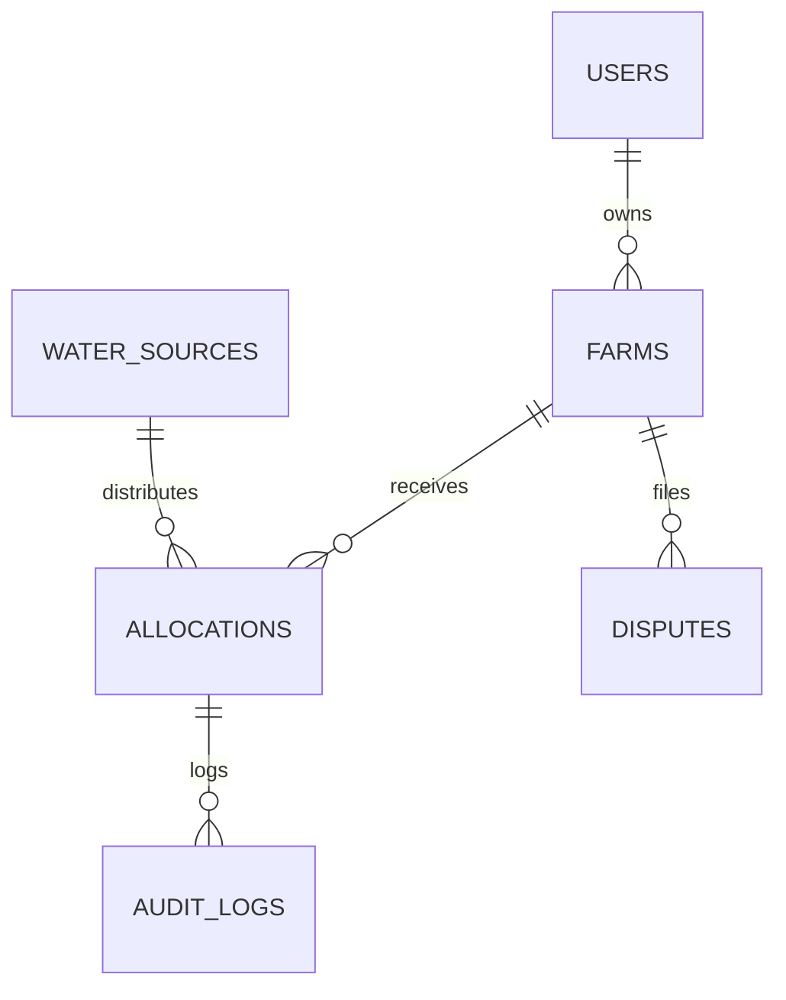

# PaaniPanchayat — Data Directory & Schema Specification

This directory documents the database schemas, mathematical factors, crop coefficients ($K_c$), and sample test data used by the PaaniPanchayat optimization and allocation engine.

---

## 1. Database Overview (SQLite / SQLAlchemy)

The primary database engine is SQLite with SQLAlchemy ORM, operating under strict transactional safety.

### Core Tables & Relationships

### Table Definitions

| Table Name | Description | Key Attributes |
| :--- | :--- | :--- |
| **`users`** | Authentication & RBAC accounts | `id`, `name`, `email`, `password_hash`, `role` (`farmer`/`admin`), `contact` |
| **`water_sources`**| Canal or reservoir water reserves | `id`, `name`, `capacity_liters`, `available_volume_liters`, `cycle_number` |
| **`farms`** | Agricultural land parcels & crop state | `id`, `user_id`, `farmer_name`, `area_acres`, `soil_type`, `crop_name`, `growth_stage`, `irrigation_efficiency`, `is_critical_stage`, `emergency_priority` |
| **`allocations`** | Linear optimizer allocation results | `id`, `water_source_id`, `farm_id`, `required_liters`, `allocated_liters`, `unmet_liters`, `fairness_score`, `schedule_start`, `schedule_end` |
| **`disputes`** | Farmer mediation requests & AI resolutions | `id`, `farm_id`, `farmer_name`, `objection_text`, `ai_mediation_proposal`, `status` |
| **`audit_logs`** | Transparent, immutable decision log | `id`, `entity_type`, `entity_id`, `action`, `details`, `timestamp` |

---

## 2. Crop Water Requirement Coefficients ($K_c$)

Water requirement calculation follows standard FAO-56 Penman-Monteith methodology scaled for canal water rotational cycles:

$$\text{Water Needed (L)} = \text{Area (Acres)} \times \text{Base Rate} \times K_c \times \text{Soil Factor} \times \frac{1}{\text{Irrigation Efficiency}} - \text{Rain/Prev Credits}$$

### Crop Coefficient Lookup Matrix

| Crop | Base Water Rate (L/acre) | Growth Stages & Stage Factors ($K_c$) |
| :--- | :--- | :--- |
| **Wheat** | 120,000 L | Initial: 0.70, Tillering: 0.95, Flowering: 1.15, Ripening: 0.85 |
| **Tomato** | 140,000 L | Initial: 0.60, Vegetative: 0.90, Flowering: 1.25, Fruit Development: 1.20 |
| **Sugarcane**| 250,000 L | Initial: 0.50, Tillering: 1.10, Vegetative: 1.30, Maturity: 0.90 |
| **Gram (Chana)**| 90,000 L | Initial: 0.55, Vegetative: 0.80, Flowering: 1.10, Maturity: 0.75 |
| **Cotton** | 160,000 L | Initial: 0.65, Vegetative: 0.95, Flowering: 1.20, Maturity: 0.80 |
| **Onion** | 110,000 L | Initial: 0.70, Vegetative: 0.95, Bulb Formation: 1.15, Maturity: 0.80 |

### Irrigation Efficiency Factors

- **Drip Irrigation**: $90\%$ Efficiency ($0.90$)
- **Sprinkler Irrigation**: $75\%$ Efficiency ($0.75$)
- **Surface / Flood Irrigation**: $60\%$ Efficiency ($0.60$)

---

## 3. Sample Demo Seed Data

The system provides out-of-the-box pre-seeded demo accounts and registered farms:

1. **Ramesh (Farm A)**: 2.5 Acres, Wheat, Flowering Stage, Loamy Soil, Drip Irrigation
2. **Suresh (Farm B)**: 1.8 Acres, Tomato, Fruit Development Stage, Black Soil, Sprinkler Irrigation
3. **Vikram (Farm C)**: 4.0 Acres, Sugarcane, Vegetative Stage, Clay Soil, Flood Irrigation
4. **Anita (Farm D)**: 1.2 Acres, Gram, Flowering Stage, Loamy Soil, Drip Irrigation
5. **Panchayat Admin**: Administrator with oversight over Canal Zone #1 allocations, solver parameters, and dispute resolutions
